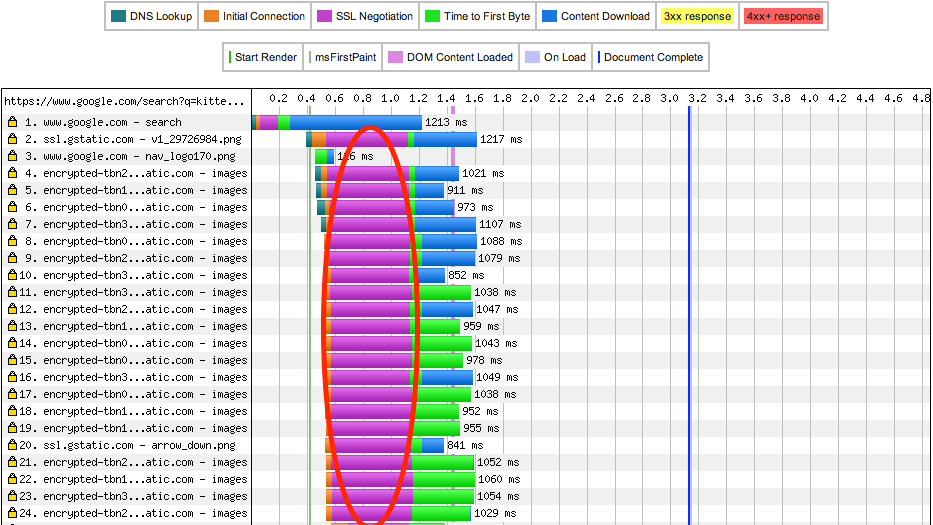
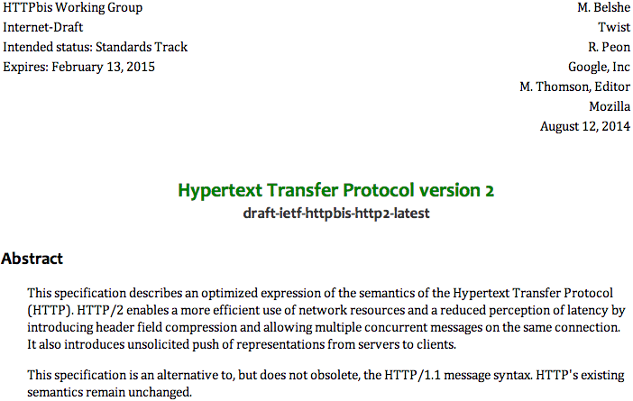

% title: HTTP 2.0 and NodeJS
% subtitle: and SPDY
% author: Halvard Skogsrud, hskogsru@thoughtworks.com
% thankyou: Thanks!
% contact: npm <a href="https://github.com/halvards/spdy-referrer-push">https://github.com/halvards/spdy-referrer-push</a>
% favicon: theme/favicon.ico

---
title: Agenda

- Why HTTP 2.0?
- TCP refresher
- SPDY and HTTP 2.0
- New features
- Protocol negotation
- Server push demo

---
title: Why HTTP 2.0?
class: img-top-center
note: <li>From Mike Belshe's paper on Why bandwidth doesn't matter much</li><li>Why is this? Latency</li>

---
title: Latency is the killer
class: img-top-center

---
title: HTTP 1.1 State of the Art
note: <li>Multiple connections: Spec recommended 2, browsers now use 6</li><li>We inline and sprite, so fewer roundtrips. Roundtrips are latency</li><li>Multiple sharded hosts, overloading switches etc.</li>
</li>

- Use persistent TCP connections
- Pipelining troublesome, so not used
- Multiple connections for parallelism
- Resource sharding for more parallelism
- Inlining and image spriting for fewer round trips

---
title:
note: <li>Browsers open up to 6 connections (was 2)</li><li>Mobile network: what if your connection drops?</li>

<article class="flexbox vcenter">
  <object data="figures/tubes.svg" type="image/svg+xml" height="500px" width="900px"></object>
</article>

---
title:
note: <li>TLS Handshakes add to the connection setup cost!</li>

<article class="flexbox vcenter">
  
</article>

---
title: INITCWND
class: segue dark quote nobackground
note: <li>Initial congestion window</li>

---
title: TCP Congestion Control
note: <li>Early TCP specs said initcwnd = 1</li><li>Now 3</li><li>Google, Mozilla, others, want 10</li><li>Most CDNs use 10</li>

<article class="flexbox vcenter">
  
</article>

---
title: What is SPDY?
note: <li></li>

- An experimental protocol from Google, created in 2009
- The starting point for IETF's HTTP 2.0 standardisation work
- Not an acronym
- Keeps all existing HTTP status codes and headers
- Binary!

---
title: HTTP 2.0 is almost here
note: <li>The SPDY spec was the first draft of HTTP 2.0</li><li>There were competing specs from Microsoft and others</li><li>SPDY chosen because IETF favours implementation experience</li>

<!--<iframe data-src="http://http2.github.io/http2-spec/"></iframe>-->
<article class="flexbox vcenter">
  
</article>

---
title: Who supports SPDY?
note: <li>Not Safari</li><li>Twitter since 2012</li>

**Browsers:**  Chrome (desktop, iOS, Android), Firefox, Opera, IE 11+ (on Win8+), Amazon Silk

**Websites:**  Google, Facebook, Twitter, and more.

**Application servers/platforms:**  Apache (mod_spdy), Nginx, Ruby, Python, NodeJS, Java (Jetty and Netty)

**Networking tools:**  F5, Wireshark, cURL (in progress)

---
title: Who supports HTTP 2.0?

<!--<iframe data-src="https://github.com/http2/http2-spec/wiki/Implementations"></iframe>-->
<article class="flexbox vcenter">
  
</article>

---
title: SPDY and HTTP 2.0 Goals
note: <li>Why? lots of intermediaries (reverse proxies in particular) assume port 80 traffic is HTTP and so tries to mess with it. Don't want this to be a barries to adoption</li>

- Reduce end-user perceived latency
- Minimise deployment complexity: Don't require changes to existing network infrastructure
- Avoid the need for web site and web application creators to make changes
- Improve web security

---
title: SPDY and HTTP 2.0 Features
note: <li>TLS means we tunnel through all those pesky intermediaries</li>

- Multiplex requests over a single TCP connection: Overcome TCP slow start
- Header compression: Reduce bandwidth usage
- Request prioritisation: Important resources arrive first
- Server push: Reduce number of round trips
- Run everything over TLS*
- No changes to methods, status codes, headers, or standard ports (80, 443)

---
title: Multiplexing
note: <li>on-the-wire representation is a binary framing protocol</li><li>HTTP 1.1 supported pipelining, but responses still had to be returned in the order of requests</li><li>Leads to head-of-line blocking problems</li>

<article class="flexbox vcenter">
  <object data="figures/spdy-multiplexing.svg" type="image/svg+xml" width="900px" height="500px"></object>
</article>

---
title: Header compression
subtitle: Here be dragons!
note: <li>Used to use zlib.</li><li>Now uses header tables shared between client and server. Incrementally updated</li><li></li>

- Why? Lots of mostly repeated header content in every request and response
- Initial spec used zlib but then CRIME came along
- CRIME (Compression Ratio Info-leak Made Easy): compression and encryption don't mix well
- Inject different plaintext and observe change in compressed size
- Now using HPACK, this has slowed implementation effort

---
title: Server push
subtitle: Shove resources down browsers' throats
note: <li>This is not WebSockets!</li>

- Send resources to browsers unsolicited
- By the time the browser has parsed the HTML/JS and wants to request the resource, it's already in the browser cache

<pre class="prettyprint" data-lang="javascript">
<b>if (request.url === '/index.html'</b> && response.push) {
  var stream = <b>response.push('/jquery.js'</b>, {'Content-Type': 'text/javascript'}, 
  <b>fs.createReadStream('/jquery.js').pipe(stream)</b>;
}
</pre>

---
title: Negotiating HTTP 1.1 vs 2.0 vs SPDY
note: Chrome and Firefox have stated they will only support HTTP 2.0 over TLS.</li><li>Microsoft states they will support HTTP 2.0 plaintext</li>

- NPN: Next Protocol Negotiation (SPDY)
- ALPN: Application Layer Protocol Negotiation (HTTP 2.0)
- These are TLS extensions
- Upgrade handshake for HTTP 2.0 over non-TLS connection
- Allows SPDY/HTTP 2.0 to run on the same ports as HTTP(S)

---
title: SPDY vs HTTP 2.0
note: <li>What's different?</li>

- Protocol identification headers
- NPN vs ALPN for negotiating HTTP 1.1 vs 2.0 vs SPDY
- HTTP 2.0 supports plaintext mode via 'Upgrade' handshake*

---
title: NodeJS Support
note: <li>SPDY good, HTTP 2.0 too early</li><li>Similar challenges on other platforms</li>

- SPDY support available for Connect-based applications via node-spdy
- Automated server push Express middleware via spdy-referrer-push
- HTTP 2.0 support available via node-http2
- BUT ALPN support will not be available until OpenSSL has stabilised its implementation. Or use a forked version of NodeJS.

---
title: Server push demo!
class: segue dark quote nobackground

---
title: References

- M. Belshe: [More Bandwidth Doesn’t Matter (Much)](https://docs.google.com/a/chromium.org/viewer?a=v&pid=sites&srcid=Y2hyb21pdW0ub3JnfGRldnxneDoxMzcyOWI1N2I4YzI3NzE2)
- IETF Draft: [Hypertext Transfer Protocol version 2.0](http://http2.github.io/http2-spec/)
- M. Nottingham: [Opportunistic Encryption for HTTP URIs](http://tools.ietf.org/html/draft-nottingham-http2-encryption-02)
- [NodeJS SPDY module](https://github.com/indutny/node-spdy) and [NodeJS HTTP 2.0 module](https://github.com/molnarg/node-http2)
- ExpressJS middleware for automatic server push:  [npm spdy-referrer-push](https://github.com/halvards/spdy-referrer-push) (Shameless plug)
- [Jetty's SPDY modules](http://www.eclipse.org/jetty/documentation/current/spdy.html)
- C. Strom: [The SPDY Book](http://pragprog.com/book/csspdy/the-spdy-book) (Very dated now)
